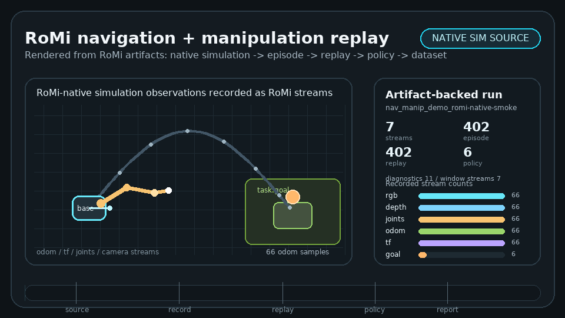

# RoMi

**Physical AI-friendly robotics middleware for replayable, inspectable, simulation-native robot runtimes.**

RoMi stands for **Robotics Middleware**. It is an early pre-MVP project exploring a bridge-first contract layer between live robots, simulators, recorded episodes, datasets, ML policies, and deployment runtimes.

<p align="center">
  <a href="examples/navigation_manipulation_demo/capture-guide.md">
    
  </a>
</p>

## Demo Video

README video target: **navigation + manipulation runtime contract demo**.

The video slot is intentionally first. After capture, upload the video to GitHub and paste the asset URL here:

```text
https://github.com/<owner>/<repo>/assets/<asset-id>
```

Current smoke demo:

```text
ROS2 camera / depth / joints / odom / TF / goal
  -> RoMi ROS2 bridge JSONL
  -> episode recorder
  -> replay source
  -> mock policy
  -> dataset inspection report
  -> README animation rendered from RoMi artifacts
```

Run it from the repository root inside a sourced ROS2 environment:

```bash
examples/navigation_manipulation_demo/run_smoke_demo.sh
```

The script runs a small ROS2 navigation + manipulation publisher, records a prototype RoMi episode, replays it, emits non-authoritative `policy.proposed_action` samples, generates `dataset-report/report.md`, and re-renders the README GIF from those artifacts.

## What RoMi Is

RoMi is a Physical AI-friendly robotics middleware direction focused on:

- Replay-first robot runtimes
- Inspectable runtime graphs
- Simulation-native development
- Dataset-aware logging and replay
- Policy-runtime integration
- ROS2 interoperability without becoming ROS2-only
- Transport-agnostic contracts

RoMi is not a claim that ROS or ROS2 should be discarded. The first goal is interop and better runtime contracts, not ecosystem replacement.

## Current Prototype

The current repository contains a small end-to-end prototype path:

- [ROS2 bridge prototype](bridges/ros2/rclpy_bridge)
- [Episode recorder](tools/episode_recorder)
- [Replay source](tools/replay_source)
- [Mock policy](tools/mock_policy)
- [Dataset inspector](tools/dataset_inspector)
- [Navigation + manipulation demo](examples/navigation_manipulation_demo)
- [Capture guide](examples/navigation_manipulation_demo/capture-guide.md)

This is a prototype contract demo, not a production robot runtime.

## Docs

- [Vision](docs/vision.md)
- [Requirements](docs/requirements.md)
- [Architecture](docs/architecture.md)
- [ROS2 interop](docs/ros2-interop.md)
- [MVP proposal](docs/mvp.md)
- [Demo spec](docs/demo-spec.md)
- [Demo backlog](docs/demo-backlog.md)
- [Roadmap](docs/roadmap.md)
- [Repository structure](docs/repository-structure.md)

## Status

Development status: **early concept / pre-MVP**.

RoMi is not:

- Production-ready
- A full ROS replacement
- DDS-only, ROS2-only, Python-only, C++-only, or Rust-only
- A simulator, ML framework, dataset format, or robot SDK by itself

## Contributing

Good early contributions clarify schemas, replay behavior, ROS2 bridge boundaries, observability, dataset workflows, and policy-runtime contracts.
