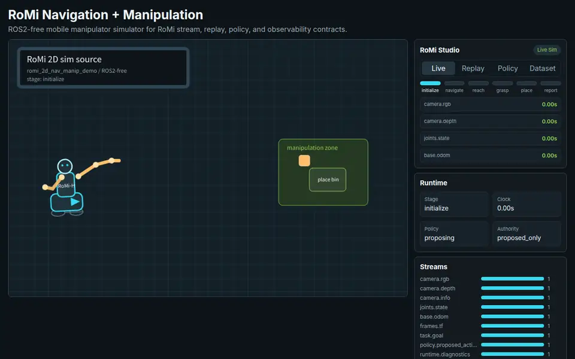

# RoMi

[](https://github.com/rsasaki0109/RoMi/actions/workflows/ci.yml)

**Physical AI-friendly robotics middleware for replay-first, inspectable, simulation-native robot runtimes.**

Replay a robot episode, swap a policy, and inspect what changed before touching actuators.

RoMi stands for **Robotics Middleware**. It is an early pre-MVP project exploring a bridge-first contract layer between live robots, simulators, recorded episodes, datasets, ML policies, and deployment runtimes.

- Run a ROS2-free navigation + manipulation simulator.
- Record and replay RoMi-shaped camera, depth, joint, odometry, TF, goal, and policy streams.
- Export dataset, policy comparison, replay timeline, safety, and bridge diagnostics artifacts for review.

<p align="center">
  <a href="docs/assets/romi-2d-nav-manip-demo.mp4">
    
  </a>
</p>

<p align="center">
  <sub>Actual RoMi 2D simulator capture: ROS2-free navigation/manipulation with RoMi Studio for replay, policy comparison, timeline evaluation, safety boundaries, and dataset state.</sub>
</p>

## Try It

Current visual target: **RoMi 2D semi-humanoid navigation + manipulation simulator**.

Run the default ROS2-free smoke demo from the repository root:

```bash
examples/navigation_manipulation_demo/run_smoke_demo.sh
```

It generates a simulation stream, records an episode, replays it, emits non-authoritative `policy.proposed_action` samples, and writes a dataset report.

Open the browser Studio demo locally:

```bash
python3 -m http.server 8000 --bind 127.0.0.1 --directory examples/navigation_manipulation_demo
# in another terminal:
xdg-open http://127.0.0.1:8000/romi_2d_sim/
```

Run browser-backed contract checks or regenerate README media locally:

```bash
python -m pip install -r requirements-browser.txt
python tests/check_browser_native_contract.py
python examples/navigation_manipulation_demo/capture_readme_video.py
```

These commands require Chrome or Chromium. The capture command can use system
`ffmpeg` or the Python `imageio-ffmpeg` package from `requirements-browser.txt`.

What this demo currently proves:

- The navigation + manipulation scenario can run without ROS2.
- The browser simulator and native smoke source share the same scenario contract.
- The pipeline records an episode, replays it, runs a mock policy, and generates a dataset report.
- Counterfactual policy comparison can be inspected and exported as Markdown or JSON evaluation artifacts.
- Replay-wide timeline evaluation and safety authority reports are committed as reviewable artifacts.
- ROS2 bridge diagnostics have a schema-backed sample covering QoS, TF, timing, and limitations.
- Policy output is `proposed_only`; it is not actuator authority.

Sample artifacts:

- [policy_compare.md](examples/navigation_manipulation_demo/sample_output/policy_compare.md)
- [policy_compare.json](examples/navigation_manipulation_demo/sample_output/policy_compare.json)
- [evaluation_timeline.md](examples/navigation_manipulation_demo/sample_output/evaluation_timeline.md)
- [evaluation_timeline.json](examples/navigation_manipulation_demo/sample_output/evaluation_timeline.json)
- [dataset-report/report.md](examples/navigation_manipulation_demo/sample_output/dataset-report/report.md)
- [dataset-report/report.json](examples/navigation_manipulation_demo/sample_output/dataset-report/report.json)
- [report_manifest.json](examples/navigation_manipulation_demo/sample_output/report_manifest.json)
- [safety_authority.md](examples/navigation_manipulation_demo/sample_output/safety_authority.md)
- [safety_authority.json](examples/navigation_manipulation_demo/sample_output/safety_authority.json)
- [ros2-qos-diagnostics.example.json](examples/navigation_manipulation_demo/ros2-qos-diagnostics.example.json)

Regenerate the committed sample artifacts:

```bash
python examples/navigation_manipulation_demo/generate_sample_artifacts.py
```

Current smoke demo:

```text
RoMi-native simulation: camera / depth / joints / odom / TF / goal
  -> episode recorder
  -> replay source
  -> mock policy
  -> dataset inspection report
  -> RoMi Studio policy comparison artifact
  -> replay evaluation timeline artifact
  -> safety authority artifact
```

Optional ROS2 interop mode:

```text
ROS2 camera / depth / joints / odom / TF / static TF / goal
  -> RoMi ROS2 bridge
  -> episode recorder
  -> replay source
  -> mock policy
  -> dataset inspection report
  -> RoMi Studio policy comparison artifact
  -> replay evaluation timeline artifact
  -> ROS2 bridge diagnostics artifact
```

To exercise the ROS2 bridge instead:

```bash
ROMI_DEMO_SOURCE=ros2 examples/navigation_manipulation_demo/run_smoke_demo.sh
```

Run that command inside a sourced ROS2 environment with the demo message
packages available. The detailed scripted ROS2 runbook, expected files, and
troubleshooting notes live in
[bridges/ros2/rclpy_bridge](bridges/ros2/rclpy_bridge).

## What RoMi Is

RoMi is a Physical AI-friendly robotics middleware direction focused on:

- Replay-first robot runtimes
- Inspectable runtime graphs
- Simulation-native development
- Dataset-aware logging and replay
- Policy-runtime integration
- ROS2 interoperability without becoming ROS2-only
- Transport-agnostic contracts

RoMi is not a claim that ROS or ROS2 should be discarded. The first goal is interop and better runtime contracts, not ecosystem replacement.

## Current Prototype

The current repository contains a small end-to-end prototype path:

- [ROS2 bridge prototype](bridges/ros2/rclpy_bridge)
- [ROS2 bridge diagnostics sample](examples/navigation_manipulation_demo/ros2-qos-diagnostics.example.json)
- [Episode recorder](tools/episode_recorder)
- [Replay source](tools/replay_source)
- [Mock policy](tools/mock_policy)
- [Dataset inspector](tools/dataset_inspector)
- [Navigation + manipulation demo](examples/navigation_manipulation_demo)
- [RoMi Studio mini browser simulator](examples/navigation_manipulation_demo/romi_2d_sim)
- [Capture guide](examples/navigation_manipulation_demo/capture-guide.md)

This is a prototype contract demo, not a production robot runtime.

## Docs

- [Project plan](PLAN.md)
- [Vision](docs/vision.md)
- [Requirements](docs/requirements.md)
- [Architecture](docs/architecture.md)
- [ROS2 interop](docs/ros2-interop.md)
- [MVP proposal](docs/mvp.md)
- [Demo contract](docs/demo-contract.md)
- [Demo spec](docs/demo-spec.md)
- [Demo backlog](docs/demo-backlog.md)
- [Roadmap](docs/roadmap.md)
- [Repository structure](docs/repository-structure.md)

## Status

Development status: **early concept / pre-MVP**.

RoMi is not:

- Production-ready
- A full ROS replacement
- DDS-only, ROS2-only, Python-only, C++-only, or Rust-only
- A simulator, ML framework, dataset format, or robot SDK by itself

## Contributing

Good early contributions clarify schemas, replay behavior, ROS2 bridge boundaries, observability, dataset workflows, and policy-runtime contracts.
