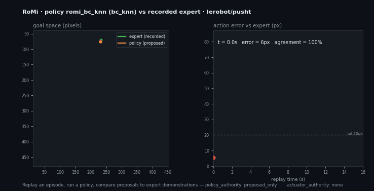

# LeRobot VLA Counterfactual Evaluation

**Replay a real robot episode, run a policy, and measure exactly how far its
proposed actions are from the recorded expert demonstration — before any
actuator is touched.**

This example takes a public [LeRobot](https://github.com/huggingface/lerobot)
dataset episode (default: `lerobot/pusht`), imports it into the RoMi stream
contract, runs a non-authoritative policy over the replay, and produces a
counterfactual evaluation report comparing the policy's proposed navigation
goals against the recorded expert actions.

<p align="center">
  
</p>

```text
LeRobot episode (real public data)
  -> RoMi import (stream-sample envelopes, no torch/lerobot needed)
  -> replay
  -> policy proposal  (heuristic baseline | bc_knn imitation | Claude | a VLA)
  -> counterfactual eval vs recorded expert actions
  -> policy_eval.md / policy_eval.json
  -> actuator authority stays "none"
```

Why this matters: the recorded `action` in an imitation dataset *is* the expert
demonstration. Comparing a policy's proposals against it on replay gives a
reproducible, inspectable answer to "how close is this policy to expert
behavior, and where does it diverge?" — with no robot and no actuator authority.

## Quick start

```bash
# Offline: use the committed sample episode (no network, no API key)
./run_eval.sh --offline

# Fresh data: fetch lerobot/pusht episode 0 from HuggingFace
./run_eval.sh

# Learned imitation policy (k-NN behavior cloning over demonstrated episodes)
BACKEND=bc_knn ./run_eval.sh --offline    # numpy only, no API key, no GPU

# Use the Claude reasoning policy instead
BACKEND=claude ./run_eval.sh --offline    # needs ANTHROPIC_API_KEY

# A different episode or dataset
REPO_ID=lerobot/pusht EPISODE=5 ./run_eval.sh
```

Outputs land in `out/` (git-ignored). Committed reference artifacts live in
[`sample_output/`](sample_output/).

## What the report looks like

See [`sample_output/policy_eval.md`](sample_output/policy_eval.md). The heuristic
go-to-center baseline on `pusht` episode 0 diverges substantially from the expert
(it never sees the block), which is exactly the kind of gap this tool surfaces:

| Metric | Value |
| --- | --- |
| Matched steps | 161 |
| Mean action error | 55.6 px |
| Agreement within 20 px | 8.7% |
| Max divergence | 99.6 px at t=8.7s |
| Policy / actuator authority | `proposed_only` / `none` |

The Markdown report also renders an action-error sparkline across the replay so
you can see *when* the policy diverges, not just by how much.

## Compare a naive baseline against a learned policy

The same harness evaluates any policy. Here a **k-NN behavior-cloning policy**
(`bc_knn`), learned only from 20 *other* `pusht` episodes and evaluated on the
held-out episode 0, is compared against the naive go-to-center baseline:

| Policy | Mean action error | Agreement within 20 px |
| --- | --- | --- |
| `heuristic` (go-to-center) | 55.6 px | 8.7% |
| **`bc_knn`** (learned from demos) | **21.3 px** | **56.5%** |

<p align="center">
  
</p>

The learned policy tracks the recorded expert far more closely — and the report
shows exactly where it still diverges. Build the imitation memory with:

```bash
python3 ../../tools/vla_policy/build_bc_memory.py \
  --episodes 1-20 --output sample_output/bc_memory.json
```

## Pieces

| Tool | Role |
| --- | --- |
| [`tools/lerobot_import`](../../tools/lerobot_import) | LeRobot v3 episode → RoMi episode JSONL (parquet over HTTP, no torch) |
| [`tools/vla_policy`](../../tools/vla_policy) | Pluggable policy: `heuristic` (offline), `bc_knn` (learned), or `claude` |
| [`tools/vla_policy/build_bc_memory.py`](../../tools/vla_policy) | Build the imitation memory for `bc_knn` from demonstration episodes |
| [`tools/policy_eval`](../../tools/policy_eval) | Counterfactual eval: proposals vs recorded expert actions |
| [`tools/policy_eval/romi_eval_visualize.py`](../../tools/policy_eval) | Render the eval report into the animation above (GIF + poster PNG) |

Regenerate the animation from a committed report with:

```bash
python3 ../../tools/policy_eval/romi_eval_visualize.py \
  --report sample_output/policy_eval.json \
  --gif-output ../../docs/assets/lerobot-vla-eval.gif \
  --png-output ../../docs/assets/lerobot-vla-eval-poster.png
```

The policy backends share one observation/output envelope, so a real local VLA
(OpenVLA / SmolVLA) can be dropped in behind the same interface later.

## Action-space mapping

PushT is a 2D pushing task. RoMi maps it onto its existing action space so the
envelopes validate against the same schemas as the navigation/manipulation demo:

- `observation.state` (agent x,y) → `robot.base.odom` (`odometry`)
- recorded `action` (target x,y) → `expert.action` (`command`, tagged
  `recorded_demonstration`)
- dataset task string → `task.goal` (`task_goal`)
- policy output → `policy.proposed_action` (`navigate_to_goal`, `proposed_only`)

## Safety boundary

The policy only ever *proposes*. Every proposal and the evaluation report carry:

- `policy_authority: proposed_only`
- `actuator_authority: none`
- `command_stream_emitted: false`

Promoting a proposal into an actuator command requires an external supervisor.
This evaluation never does so.

## Validation

`tests/check_lerobot_vla_eval.py` runs offline and:

- validates committed envelopes against `schemas/core/stream_sample.schema.json`
  and `schemas/ml/policy_io.schema.json`,
- validates both reports against `schemas/ml/policy_eval.schema.json`,
- re-runs the `heuristic` and `bc_knn` policies + eval and asserts the
  deterministic results reproduce the committed reports,
- asserts the actuator-authority boundary stays explicit,
- asserts the learned `bc_knn` policy beats the naive baseline.
