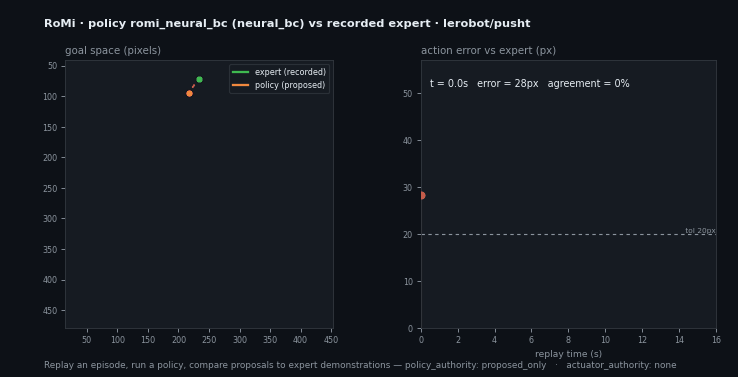
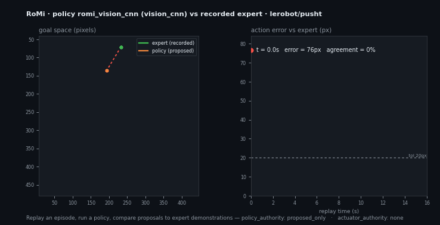
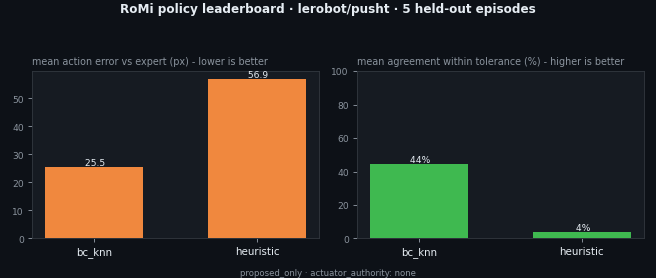

# LeRobot VLA Counterfactual Evaluation

**Replay a real robot episode, run a policy, and measure exactly how far its
proposed actions are from the recorded expert demonstration — before any
actuator is touched.**

This example takes a public [LeRobot](https://github.com/huggingface/lerobot)
dataset episode (default: `lerobot/pusht`), imports it into the RoMi stream
contract, runs a non-authoritative policy over the replay, and produces a
counterfactual evaluation report comparing the policy's proposed navigation
goals against the recorded expert actions.

<p align="center">
  
</p>

```text
LeRobot episode (real public data)
  -> RoMi import (stream-sample envelopes, no torch/lerobot needed)
  -> replay
  -> policy proposal  (heuristic baseline | bc_knn imitation | Claude | a VLA)
  -> counterfactual eval vs recorded expert actions
  -> policy_eval.md / policy_eval.json
  -> actuator authority stays "none"
```

Why this matters: the recorded `action` in an imitation dataset *is* the expert
demonstration. Comparing a policy's proposals against it on replay gives a
reproducible, inspectable answer to "how close is this policy to expert
behavior, and where does it diverge?" — with no robot and no actuator authority.

## Quick start

```bash
# Offline: use the committed sample episode (no network, no API key)
./run_eval.sh --offline

# Fresh data: fetch lerobot/pusht episode 0 from HuggingFace
./run_eval.sh

# Learned imitation policy (k-NN behavior cloning over demonstrated episodes)
BACKEND=bc_knn ./run_eval.sh --offline    # numpy only, no API key, no GPU

# Use the Claude reasoning policy instead
BACKEND=claude ./run_eval.sh --offline    # needs ANTHROPIC_API_KEY

# A different episode or dataset
REPO_ID=lerobot/pusht EPISODE=5 ./run_eval.sh
```

Outputs land in `out/` (git-ignored). Committed reference artifacts live in
[`sample_output/`](sample_output/).

## What the report looks like

See [`sample_output/policy_eval.md`](sample_output/policy_eval.md). The heuristic
go-to-center baseline on `pusht` episode 0 diverges substantially from the expert
(it never sees the block), which is exactly the kind of gap this tool surfaces:

| Metric | Value |
| --- | --- |
| Matched steps | 161 |
| Mean action error | 55.6 px |
| Agreement within 20 px | 8.7% |
| Max divergence | 99.6 px at t=8.7s |
| Policy / actuator authority | `proposed_only` / `none` |

The Markdown report also renders an action-error sparkline across the replay so
you can see *when* the policy diverges, not just by how much.

## Compare a naive baseline against learned policies

The same harness evaluates any policy. Here two learned policies — a **k-NN
behavior-cloning policy** (`bc_knn`) and a **GPU-trained neural MLP** (`neural_bc`),
both learned only from *other* `pusht` episodes — are compared against the naive
go-to-center baseline on the held-out episode 0:

| Policy | Observation | Mean action error | Agreement within 20 px |
| --- | --- | --- | --- |
| `heuristic` (go-to-center) | state | 55.6 px | 8.7% |
| `bc_knn` (k-NN imitation) | state | 21.3 px | 56.5% |
| **`neural_bc`** (GPU-trained MLP) | state | **18.3 px** | **60.2%** |
| `vision_cnn` (GPU-trained CNN) | **camera image** | 26.5 px | 45.3% |

<p align="center">
  
</p>

Every learned policy tracks the recorded expert far more closely than the
baseline, and the report shows exactly where each still diverges. Build the
imitation memory and train the learned policies with:

```bash
# k-NN imitation memory (numpy only)
python3 ../../tools/vla_policy/build_bc_memory.py \
  --episodes 1-20 --output sample_output/bc_memory.json

# GPU-trained neural behavior-cloning policy (torch; uses CUDA when available)
python3 ../../tools/vla_policy/train_bc_mlp.py \
  --episodes 1-50 --epochs 600 --output sample_output/bc_mlp_weights.json
```

### Vision policy (image → action)

`vision_cnn` is a real GPU-trained convolutional policy that consumes the
**camera frame** instead of the 2D state — the "V" a full VLA also uses. On this
task the state is so directly tied to the action that the state-based policies
score higher; the harness makes that observation-modality tradeoff measurable on
the same footing.

<p align="center">
  
</p>

```bash
# Decode the held-out episode's camera frames (software AV1 via ffmpeg)
python3 ../../tools/lerobot_import/extract_frames.py \
  --episode 0 --output sample_output/frames_ep0.npz

# Train the CNN vision policy on demonstration frames (torch; CUDA when available)
python3 ../../tools/vla_policy/train_cnn_bc.py \
  --episodes 1-30 --epochs 40 --output sample_output/cnn_bc_weights.npz

# Run it (reads the camera frames, deterministic CPU inference)
python3 ../../tools/vla_policy/romi_vla_policy.py --input sample_output/episode.jsonl \
  --backend vision_cnn --vision-weights sample_output/cnn_bc_weights.npz \
  --frames sample_output/frames_ep0.npz --device cpu --output /tmp/policy.vision_cnn.jsonl
```

A real vision-language VLA (OpenVLA / SmolVLA) can replace this CNN behind the
same `propose()` interface.

## Dataset-scale leaderboard

The same harness scores policies across a *set* of held-out episodes and ranks
them, so the comparison is not a single-episode fluke:

<p align="center">
  
</p>

See [`sample_output/leaderboard.md`](sample_output/leaderboard.md). Regenerate it
across episodes `0,21,22,23,24` (held out from the `bc_knn` training set) with:

```bash
python3 ../../tools/policy_eval/romi_batch_eval.py \
  --episodes 0,21-24 \
  --bc-memory sample_output/bc_memory.json \
  --neural-weights sample_output/bc_mlp_weights.json \
  --json-output sample_output/leaderboard.json \
  --md-output sample_output/leaderboard.md \
  --png-output ../../docs/assets/lerobot-vla-leaderboard.png
```

## Open it in Foxglove

The episode (and the policy's proposals) export to an [MCAP](https://mcap.dev)
file that opens directly in [Foxglove Studio](https://foxglove.dev):

```bash
python3 ../../tools/mcap_export/romi_mcap_export.py \
  --episode sample_output/episode.jsonl \
  --policy sample_output/policy.bc_knn.jsonl \
  --output sample_output/episode.mcap
```

Open [`sample_output/episode.mcap`](sample_output/episode.mcap) in Foxglove
(`File → Open local file`) to scrub the agent pose (`/robot/base/pose`), the
recorded expert goal (`/expert/goal`), and the policy's proposed goal
(`/policy/proposed_goal`) together on one timeline. RoMi stays
MCAP-compatible, not MCAP-only.

## Pieces

| Tool | Role |
| --- | --- |
| [`tools/lerobot_import`](../../tools/lerobot_import) | LeRobot v3 episode → RoMi episode JSONL (parquet over HTTP, no torch) |
| [`tools/lerobot_import/extract_frames.py`](../../tools/lerobot_import) | Decode an episode's camera frames to an NPZ (software AV1 via ffmpeg) |
| [`tools/vla_policy`](../../tools/vla_policy) | Pluggable policy: `heuristic`, `bc_knn`, `neural_bc`, `vision_cnn`, or `claude` |
| [`tools/vla_policy/build_bc_memory.py`](../../tools/vla_policy) | Build the imitation memory for `bc_knn` from demonstration episodes |
| [`tools/vla_policy/train_bc_mlp.py`](../../tools/vla_policy) | Train the `neural_bc` MLP policy on demonstrations (GPU when available) |
| [`tools/vla_policy/train_cnn_bc.py`](../../tools/vla_policy) | Train the `vision_cnn` image policy on demonstration frames (GPU when available) |
| [`tools/policy_eval`](../../tools/policy_eval) | Counterfactual eval: proposals vs recorded expert actions |
| [`tools/policy_eval/romi_batch_eval.py`](../../tools/policy_eval) | Score and rank policies across held-out episodes (leaderboard) |
| [`tools/policy_eval/romi_eval_visualize.py`](../../tools/policy_eval) | Render the eval report into the animation above (GIF + poster PNG) |
| [`tools/mcap_export`](../../tools/mcap_export) | Export the episode + proposals to a Foxglove-ready `.mcap` |

Regenerate the animation from a committed report with:

```bash
python3 ../../tools/policy_eval/romi_eval_visualize.py \
  --report sample_output/policy_eval.json \
  --gif-output ../../docs/assets/lerobot-vla-eval.gif \
  --png-output ../../docs/assets/lerobot-vla-eval-poster.png
```

The policy backends share one observation/output envelope, so a real local VLA
(OpenVLA / SmolVLA) can be dropped in behind the same interface later.

## Action-space mapping

PushT is a 2D pushing task. RoMi maps it onto its existing action space so the
envelopes validate against the same schemas as the navigation/manipulation demo:

- `observation.state` (agent x,y) → `robot.base.odom` (`odometry`)
- recorded `action` (target x,y) → `expert.action` (`command`, tagged
  `recorded_demonstration`)
- dataset task string → `task.goal` (`task_goal`)
- policy output → `policy.proposed_action` (`navigate_to_goal`, `proposed_only`)

## Safety boundary

The policy only ever *proposes*. Every proposal and the evaluation report carry:

- `policy_authority: proposed_only`
- `actuator_authority: none`
- `command_stream_emitted: false`

Promoting a proposal into an actuator command requires an external supervisor.
This evaluation never does so.

## Validation

`tests/check_lerobot_vla_eval.py` runs offline and:

- validates committed envelopes against `schemas/core/stream_sample.schema.json`
  and `schemas/ml/policy_io.schema.json`,
- validates the reports against `schemas/ml/policy_eval.schema.json` and the
  leaderboard against `schemas/ml/policy_eval_leaderboard.schema.json`,
- re-runs the `heuristic` and `bc_knn` policies + eval (and `neural_bc` when
  torch is installed) and asserts the deterministic results reproduce the
  committed reports,
- round-trips the MCAP export and checks its Foxglove channels,
- asserts the actuator-authority boundary stays explicit,
- asserts the learned `bc_knn` and `neural_bc` policies beat the naive baseline
  and that `neural_bc` tops the held-out leaderboard.
